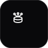

<div align="center">



# UniDisk — Infinite Cloud Storage

### ♾️ Turn unlimited free cloud accounts into one giant unified drive.

**Self-hosted storage aggregation.** Connect as many Google Drive, Dropbox,
OneDrive, Box, pCloud, and S3-compatible accounts as you want, and use them
together as a single, ever-growing storage pool — need more space? Just connect
another account. UniDisk stores only **metadata and orchestration**; your files
stay in your own provider accounts.

[](https://github.com/Kayamii/UniDisk/actions/workflows/publish.yml)
[](LICENSE)
[](https://github.com/Kayamii/UniDisk/pkgs/container/unidisk)

</div>

---

## What it does

You probably have free space scattered across several cloud accounts — a couple
of Google accounts, a Dropbox, a OneDrive. UniDisk pools them into **one
filesystem**: you upload a file, it's automatically placed on whichever account
has room; you browse, search, preview, and download everything from one place,
without caring where each file physically lives.

```
 Google Drive (15 GB)  ┐
 Google Drive (15 GB)  ├──►  UniDisk pool  ──►  one unified drive, 37 GB total
 OneDrive     (5 GB)   │     files spread automatically across accounts
 Dropbox      (2 GB)   ┘
```

## Features

- **6 provider types** — Google Drive, Dropbox, OneDrive, Box, pCloud, and any
  **S3-compatible** store (Amazon S3, Backblaze B2, Wasabi, Cloudflare R2,
  MinIO, DigitalOcean Spaces).
- **Multiple accounts per provider** — connect as many Google/Dropbox/… accounts
  as you like; they all add to the pool.
- **One-click "Connect"** for OAuth providers, plus a manual-credentials form for
  S3 — the dashboard renders each provider's form from a declared schema and
  verifies it live before saving.
- **Smart routing** — new files are spread **round-robin** across accounts below
  a configurable fill threshold; when all are near-full it falls back to the one
  with the most free space.
- **Stream-through transfers** — bytes stream user ⇄ server ⇄ provider with no
  disk buffering, with live upload speed and download progress.
- **File manager** — folders, drag-and-drop upload, search, grid/list views,
  rename, delete, and in-app **preview** (images, PDF, video, audio, text/code).
- **RBAC** — built-in **Admin** and **Viewer** roles plus custom roles with
  granular privileges; admin-managed users with forced first-login password
  change. No open sign-up.
- **API keys** — generate scoped keys (file permissions only, never exceeding
  yours) to use UniDisk as storage from apps, scripts, and web servers.
- **Presigned share links** — create public, expiring, direct-download URLs for
  a file (S3-style), via the UI or the API.
- **Encryption at rest** — provider credentials/tokens are AES-256-GCM encrypted
  in the database.
- **Single binary, single container** — Go backend + React SPA, SQLite storage.
  Works by IP or DNS, with or without a reverse proxy, no config required.

## Screenshots

<!-- Add screenshots/GIFs here before release, e.g.: -->
<!--  -->
<!--  -->

---

## Quick start (Docker)

```bash
# 1. Get the compose file and an env file
git clone https://github.com/Kayamii/UniDisk.git
cd UniDisk
cp .env.example .env        # then edit .env (at least the admin password)

# 2. Run
docker compose up -d
```

Open **http://localhost:8080** and sign in with the admin credentials from your
`.env` (default `admin@unidisk.local` / `changeme123`). Then go to **Providers →
Add provider** to connect storage.

> Port 8080 already taken? Set `UNIDISK_PORT=8081` in your `.env` and use that.

### Or run the prebuilt image

```bash
docker run -d --name unidisk \
  -p 8080:8080 \
  -v unidisk-data:/data \
  -e UNIDISK_ADMIN_EMAIL=admin@example.com \
  -e UNIDISK_ADMIN_PASSWORD='choose-a-strong-password' \
  ghcr.io/kayamii/unidisk:latest
```

Images are published to **GitHub Container Registry** (`ghcr.io/kayamii/unidisk`)
and, if configured, **Docker Hub** (`kayamii/unidisk`) on each release, for
`linux/amd64` and `linux/arm64`.

---

## Configuration

All configuration is via environment variables (see [`.env.example`](.env.example)).
Everything is optional except the bootstrap admin on first run.

| Variable | Default | Purpose |
| --- | --- | --- |
| `UNIDISK_ADMIN_EMAIL` / `UNIDISK_ADMIN_PASSWORD` | `admin@unidisk.local` / `changeme123` | Seeds the first admin on first boot. The only way to create the initial account. |
| `UNIDISK_JWT_SECRET` | random each boot | Signs session tokens. **Set a fixed value in production** or users are logged out on restart. |
| `UNIDISK_ENCRYPTION_KEY` | auto-generated, persisted | Encrypts provider credentials at rest. Leave empty to auto-manage. |
| `UNIDISK_PUBLIC_URL` | auto-detected | Force a fixed base URL for share links / OAuth redirects. Empty = detect from the request (works by IP, DNS, or behind a proxy). |
| `UNIDISK_ADDR` | `:8080` | Listen address inside the container. |
| `UNIDISK_DATA_DIR` | `/data` | Where the SQLite DB and key file live (mount a volume here). |
| Provider OAuth apps | — | See [Adding providers](#adding-providers). |

---

## Adding providers

In the dashboard: **Providers → Add provider → pick one**. There are two styles:

- **OAuth "Connect"** (Google Drive, Dropbox, OneDrive, Box, pCloud) — you, the
  operator, register an OAuth app once and set its id/secret as env vars; users
  then connect accounts with a single click. The Connect button only appears
  once the app credentials are configured.
- **Manual credentials** (S3-compatible) — users paste access keys directly; no
  operator setup needed.

For any OAuth provider, register this **redirect URI** in its console (use the
exact URL you access UniDisk at):

```
<your-url>/api/oauth/<provider>/callback
```

| Provider | Env vars | Where to create the app | Redirect URI path |
| --- | --- | --- | --- |
| Google Drive | `UNIDISK_GOOGLE_CLIENT_ID`, `UNIDISK_GOOGLE_CLIENT_SECRET` | [Google Cloud Console](https://console.cloud.google.com/) → APIs & Services → Credentials (enable the Drive API) | `/api/oauth/googledrive/callback` |
| Dropbox | `UNIDISK_DROPBOX_APP_KEY`, `UNIDISK_DROPBOX_APP_SECRET` | [Dropbox App Console](https://www.dropbox.com/developers/apps) (Scoped access, Full Dropbox) | `/api/oauth/dropbox/callback` |
| OneDrive | `UNIDISK_ONEDRIVE_CLIENT_ID`, `UNIDISK_ONEDRIVE_CLIENT_SECRET` | [Azure Portal](https://portal.azure.com/) → App registrations (Files.ReadWrite, offline_access) | `/api/oauth/onedrive/callback` |
| Box | `UNIDISK_BOX_CLIENT_ID`, `UNIDISK_BOX_CLIENT_SECRET` | [Box Developer Console](https://app.box.com/developers/console) | `/api/oauth/box/callback` |
| pCloud | `UNIDISK_PCLOUD_CLIENT_ID`, `UNIDISK_PCLOUD_CLIENT_SECRET` | [pCloud My Apps](https://docs.pcloud.com/) | `/api/oauth/pcloud/callback` |
| S3-compatible | _none_ | Per-account: access key, secret, bucket, region, endpoint | _manual form_ |

> **Connecting multiple accounts of the same provider** just works — click
> Connect again and choose a different account. (Note: Google's consent screen
> in "Testing" mode only allows emails you add as *Test users*.)

> **S3-compatible endpoints:** leave the endpoint blank for Amazon S3; for others
> use their endpoint, e.g. Backblaze `https://s3.us-west-001.backblazeb2.com`,
> Cloudflare R2 `https://<account>.r2.cloudflarestorage.com`, MinIO your server.

---

## Usage

### Users & roles
The first admin is seeded from env. Admins create users under **Users**, assign a
role, and set a temporary password (the user must change it at first login).
Define custom roles under **Roles** by ticking privileges:
`files.view`, `files.upload`, `files.download`, `files.delete`,
`providers.manage`, `users.manage`, `roles.manage`, `settings.manage`.

### API keys (use UniDisk from your apps)
Go to **API Keys → New API key**, pick file permissions (you can only grant what
you hold) and an optional expiry. The key is shown **once** — copy it. Then:

```bash
# Upload a file
curl -X POST "https://your-unidisk/api/files/upload" \
  -H "X-API-Key: udk_xxxxxxxx" \
  -H "X-Filename: logo.png" \
  --data-binary @logo.png

# Download a file by id
curl "https://your-unidisk/api/files/123/download" \
  -H "X-API-Key: udk_xxxxxxxx" -o logo.png
```

### Presigned share links
From a file's menu → **Share link**, choose an expiry, and get a public URL like
`https://your-unidisk/s/<token>` that anyone can download from — no login. Revoke
anytime. Also available via `POST /api/presigned`.

---

## Developer API

Authenticate with a session token (`Authorization: Bearer <jwt>` from
`/api/auth/login`) or an API key (`X-API-Key: udk_...`). Common endpoints:

| Method | Path | Purpose |
| --- | --- | --- |
| `POST` | `/api/auth/login` | Log in, returns a token |
| `GET` | `/api/files?parent=<id>` | List a folder |
| `POST` | `/api/files/upload` | Upload (filename in `X-Filename`, body = bytes) |
| `GET` | `/api/files/{id}/download` | Download (add `?inline=1` to preview) |
| `GET` | `/api/files/search?q=<term>` | Search files by name |
| `POST` | `/api/files/folder` | Create a folder |
| `PUT` / `DELETE` | `/api/files/{id}` | Rename / delete |
| `POST` | `/api/presigned` | Create a public share link |
| `GET` | `/api/stats` | Pool capacity overview |
| `GET` | `/s/{token}` | Public download (no auth) |

---

## Deployment

UniDisk **auto-detects the URL it's served at**, so it works with no config
whether reached by IP or domain, and behind a reverse proxy via the standard
`X-Forwarded-Proto` / `X-Forwarded-Host` headers — share links and OAuth
redirects come out correct automatically.

### Production checklist

- [ ] Set a strong `UNIDISK_ADMIN_PASSWORD` (and change it after first login).
- [ ] Set a fixed `UNIDISK_JWT_SECRET` (`openssl rand -hex 32`).
- [ ] Terminate **HTTPS** with a reverse proxy (Caddy/Nginx/Traefik/Cloudflare).
      UniDisk serves plain HTTP; most OAuth providers require https on real domains.
- [ ] Register the production redirect URIs in each provider's console.
- [ ] Back up the `/data` volume (it holds the DB and encryption key).

<details>
<summary>Example: Caddy reverse proxy (automatic HTTPS)</summary>

```caddy
unidisk.example.com {
    reverse_proxy localhost:8080
}
```
Caddy sets `X-Forwarded-*` automatically, so no UniDisk config is needed.
</details>

---

## Local development

Requires **Go 1.24+** and **Node 20+**.

```bash
# Backend (API on :8080)
cd backend
UNIDISK_DATA_DIR=./data UNIDISK_ADMIN_EMAIL=admin@local UNIDISK_ADMIN_PASSWORD=changeme123 \
  go run ./cmd/unidisk

# Frontend (Vite on :5173, proxies /api to :8080)
cd web && npm install && npm run dev
```

See [CONTRIBUTING.md](CONTRIBUTING.md) for the full workflow and how to add a
provider.

## Architecture

```
backend/   Go API + SQLite metadata store; streams files through to providers
  internal/provider/   one package per provider, implementing a shared interface
  internal/pool/       routing + stream-through orchestration
  internal/api/        HTTP handlers, RBAC middleware, OAuth, presigned links
  internal/crypto/     AES-GCM encryption for credentials at rest
web/       React + TypeScript + Tailwind + shadcn/ui dashboard
Dockerfile single multi-stage build → one container serving API + SPA
```

UniDisk stores only metadata (users, roles, file listings, and encrypted provider
credentials). File contents never touch UniDisk's disk — they stream straight
through to your providers.

## License

[MIT](LICENSE) © UniDisk contributors.
