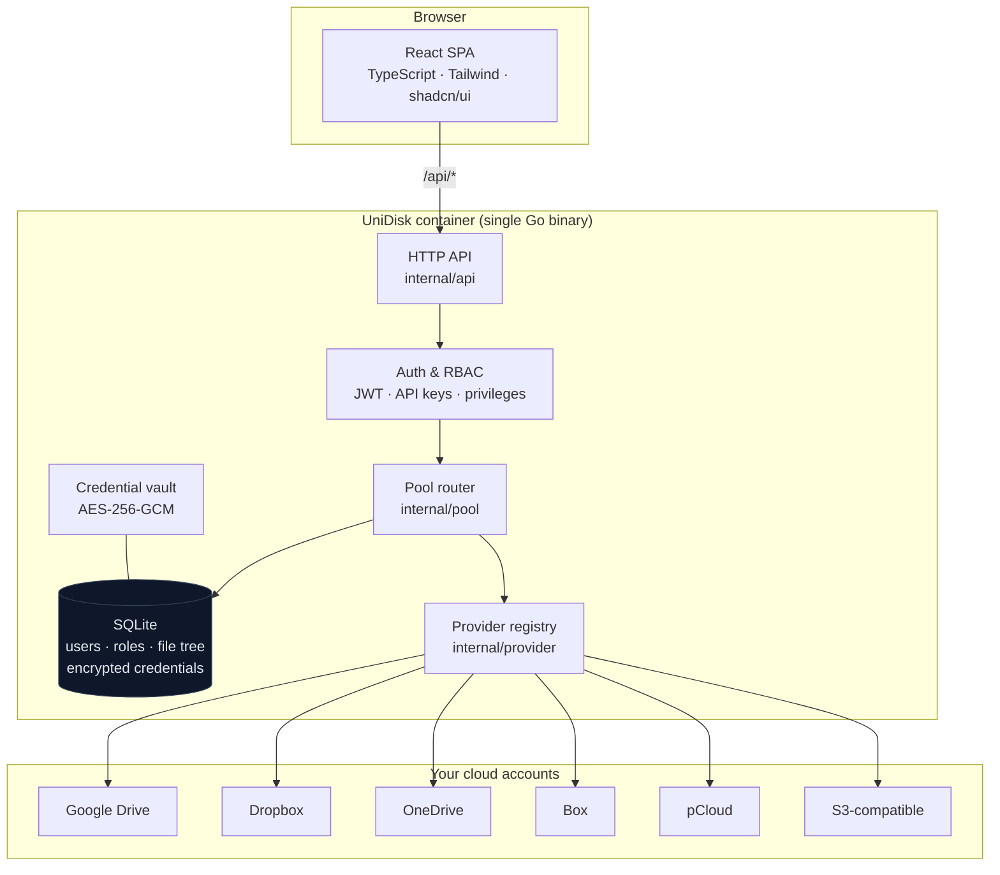
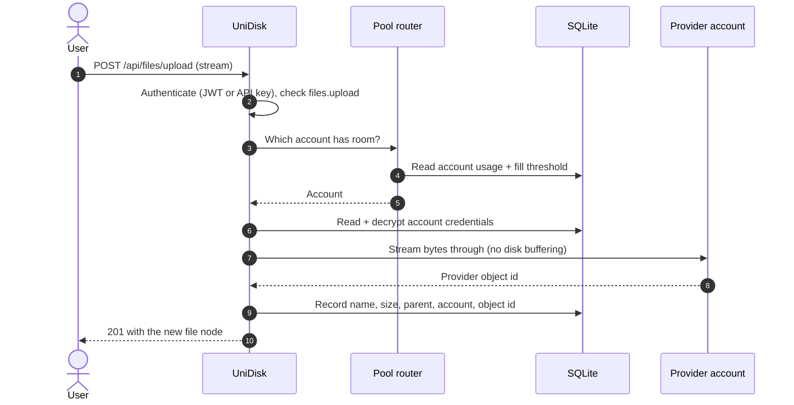

# Architecture

How UniDisk turns several ordinary cloud accounts into one drive, and what it
does — and deliberately does not — keep.

## The one-line version

UniDisk is a **metadata layer with a router in front of it**. It remembers which
provider account holds each file; when bytes move, they stream straight through
the server without ever landing on its disk.

## Components



Every provider is one package implementing a shared interface, so adding a
seventh is a self-contained change — the router, the API, and the credential
form all adapt from the interface and the provider's declared schema.

## Where a file actually goes

An upload never touches UniDisk's disk. The server opens a reader on the request
body and a writer to the chosen provider, then copies between them.



Downloads run the same path in reverse: look up which account holds the file,
open a stream from that provider, pipe it to the client.

## Routing

Uploads are spread **round-robin across every account below a fill threshold**
(80% by default, configurable under Storage Pool → Routing). When every account
is above the threshold, the file goes to whichever has the most free space.

```
accounts under threshold?  ──yes──►  round-robin among them
         │
         no
         ▼
   most free space wins
```

The practical effect: connecting another free account immediately grows the
pool, and new uploads start landing there without any migration.

## What is stored where

| Data | Location | Notes |
| --- | --- | --- |
| File **contents** | Your provider accounts | Never written to UniDisk's disk |
| File **metadata** (name, size, parent, which account) | SQLite in `/data` | The map from your file tree to provider objects |
| Users, roles, privileges | SQLite | Admin-managed; no open sign-up |
| Provider credentials & OAuth tokens | SQLite, **AES-256-GCM encrypted** | Key auto-generated and persisted in `/data` |
| API keys | SQLite, hashed | Shown once at creation |
| Share links | SQLite | Token, target file, expiry, download count |

Because `/data` holds both the database and the encryption key, it is the one
thing to back up — and the one thing to protect.

## Access control

Two layers guard every request:

1. **Identity** — either a session JWT (from `/api/auth/login`) or an API key
   (`X-API-Key: udk_…`).
2. **Privilege** — each endpoint requires one of `files.view`, `files.upload`,
   `files.download`, `files.delete`, `providers.manage`, `users.manage`,
   `roles.manage`, `settings.manage`.

Roles bundle privileges; `Admin` and `Viewer` ship built in and custom roles are
composed by ticking boxes. An API key can never hold a privilege its creator
lacks, so a key is always a narrowing of its owner's access — never an
escalation.

Presigned share links are the one unauthenticated path: `GET /s/{token}` serves
a single file until its expiry, and can be revoked at any time.

## Deployment shape

One multi-stage `Dockerfile` builds the SPA with Vite, compiles the Go binary,
and ships a single container that serves both the API and the static assets from
the same origin — so there is no CORS to configure and no second service to run.

The server detects its own public URL from the request (honoring
`X-Forwarded-Proto` / `X-Forwarded-Host`), so share links and OAuth redirects
come out right whether it is reached by IP, by domain, or through a reverse
proxy. `UNIDISK_PUBLIC_URL` overrides this when a fixed value is needed.

## The demo build

The [live demo](https://kayamii.github.io/UniDisk/) is the same React app
compiled with `VITE_DEMO=1`. In that mode the API client's single `request()`
chokepoint is redirected to an in-browser stand-in that answers the same routes
from seeded state in `localStorage` — no Go backend, no network, nothing stored
anywhere but the visitor's own browser. Production builds resolve the flag to a
constant `false`, so none of that code ships in the real image.
